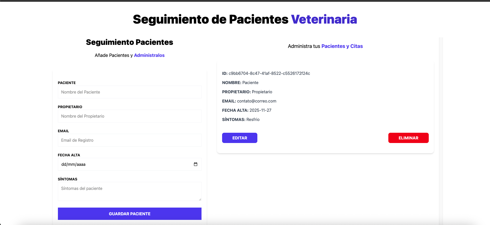

# App web de seguimiento de pacientes Veterinaria

Proyecto de app web que permite realizar seguimiento de pacientes, poder crear nuevas citas para los pacientes, editar información de la cita de un paciente y eliminar una cita de un paciente.

## Pila de tecnología

-  react 19.1.1
-  react-dom 19.1.1
-  vite 7.1.7
-  typescript 5.9.3
-  react-hook-form 7.65.0
-  zustand 5.0.8
-  tailwindcss 4.1.14

## Pantalla de App web de seguimiento de pacientes Veterinaria.

1.- Inicio
&nbsp;

 

